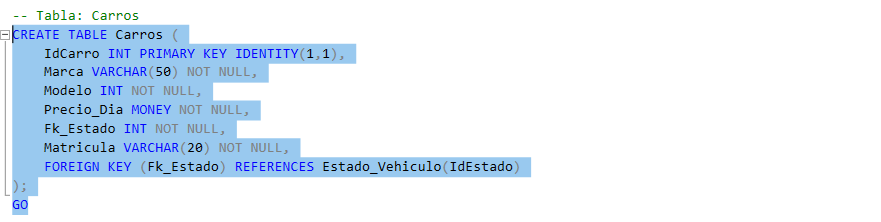
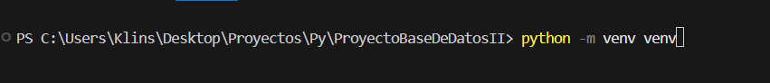

# proyecto_base_de_datos_II
Guia para instalar y trabajar el Proyecto base de datos II

# Crear la base de datos y el usuario con la que vamos a trabajar

Paso 1 - Vamos a ejecutar el archivo llamado basededatosII.sql que esta en este repositorio, con esto vamos a crear el usuario y el archivo necesario para trabajar en el proyecto, para ejecutar la base de datos traten de seleccionar primero la operacion  y ejecutarla separadamente no todo el archivo de una vez porque nos puede dar errror.

# Instalar el proyecto en la computadora local

Paso 1 - Creamos una carpeta con el nombre de base de datos II

Paso 2 - Dentro de la carpeta abrimos git bash y ejecutamos el siguiente comando:

git clone git@github.com:KevoSantana12/proyecto_base_de_datos_II.git

cd proyecto_base_de_datos_II

Con esto tendriamos la version mas actualizada de nuestro proyecto

# Compilar el servidor flask y creacion de unas variables de entorno.

Paso 1 - En el archivo principal del proyecto abrimos el cmd de Visual Studio Code y agregamos el comando
Python -m venv venv

cd .\venv\Scripts\    

.\Activate

pip install Flask 

pip install pyodbc

Paso 2 - Ejecutamos el siguiente comando para ubicarnos en la el archivo principal 

cd ../../

cd proyecto_base_de_datos_II

Python Run.py

# Nota

El archivo de acceso de datos es diferente para cada uno de nosotros ya que el servidor tiene el nombre de nuestra computadora por lo que tendremos que agregar el archivo de acceso a base de datos manual. 

